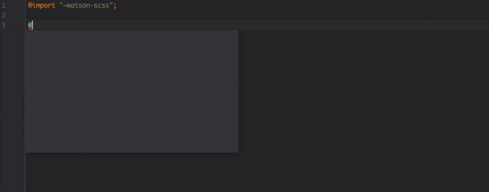

<br>

<p align="center">
  
</p>
<br>

<p align="center">
  
  
</p>

<br>

<p align="center">
  <b>
    <a href="https://zhuanlan.zhihu.com/p/28650879">SASS:简单点, 写 BEM 的方式简单点</a>
    |
    <a href="https://github.com/waynecz/Holmes">Holmes: Server boilerplate you might need</a>
  </b>
</p>

<br>

> I do recommend to use Webstorm writing SASS since it's smartest auto-completion saving me much a time

## Intro

- Mainly to simplify the way writing Nested BEM
- Tools which are most of use

<br>

## Installation

```bash
npm i watson-scss -D
```

```scss
@import '~watson-scss';
```

<br>

## What Watson got

Watson is devote itself to help write BEM fastly and furiously

#### Nested B\_\_E--M

```scss
@include block(human) {
  @include element(finger) {
    @include modifier(little) {
    }
  }

  @include modifier(male) {
    @include element(leg) {
    }
  }

  @include when(hurt) {
    @include element(hand) {
    }
  }
}
```

It's defaultly equal to:

```scss
.human {
  &__finger {
    &--little {
    }
  }

  &--male {
    .human__leg {
    }
  }

  &.is-hurt {
    .human__head {
    }
  }
}
```

AHA, here you may think the number of words you write **however was increased** ! Indeed but hang on my dude, that's why I introduce **Webstorm** for you, take a look of this
<br>

<p align="center">
  
</p>

Watson support more complicated nest rule like:

```scss
@include element(arm) {
  @include pseudo(focus) {
    @include custom-selector('+') {
      @include modifier(left) {
      }
    }

    @include custom-selector('~', hand, right) {
    }
  }
}
```

which'll convert to

```scss
.human {
  &__arm {
    &:focus {
      & + .hum__arm--left {
      }

      & ~ .human__hand--right {
      }
    }
  }
}
```

#### with-attr

```scss
@include with-attr(disabled) {
}
// equals to
&[disabled] {
}
```

<a href="#tools">See other tools below 😋</a>

<br>

## Custom configuration

```scss
@import '~watson-scss';

/* cover default config after import watson */
$block-modifier: '_' !global;
$sm: 720px !global;

/* enable namespace */
$namespace: 'ele' !global;
...
```

[Look up more configuration here](./src/core/_config.scss)

<br>

<h2 id="tools"> List of tools</h2>

#### ▸ media query

```scss
@include meadia-query(sm) {
}
// equals to
@media only screen and (min-width: 768px) {
}
```

[See more breakpoints](./src/core/_config.scss)

#### ▸ font-face

```scss
@include font-face(name, '//path/name', bold, italic);
// equals to
@font-face {
  font-family: name;
  font-style: italic;
  font-weight: bold;
  src: local($name), url('//path/name.woff2') format('woff2'), url('//path/name.woff') format('woff'), url('//path/name.ttf') format('truetype');
}
```

if you want to specify format, insert format-list as 3rd argument

```scss
@include font-face(name, '//path/name', ttf otf, bold, italic);
```

#### ▸ shapes

```scss
// circle of 30px diameter
@include circle(20px, #111);

@include square(10px);

// directions can be on of 'up' 'up-right' 'right' 'down-right'
// 'down' 'down-left' 'left' 'up-left'
@include triangle(up, 20px, 10px, #111);
```

#### ▸ transform

```scss
@include perfect-transition;
// convert to
transition: 0.2s cubic-bezier(0.4, 0, 0.2, 1);
```

```scss
transition: ts(0.2s, 1s);
// convert to
transition: 0.2s 1s cubic-bezier(0.4, 0, 0.2, 1);
```

```scss
transform: tx(3px) ty(3px) txy(2px, 3px);
// convert to
transform: translateX(3px) translateY(3px) translate(2px, 3px);
```

#### ▸ basic CN fonts

```scss
// 黑体 sans
@include font-hei;
// 楷体 serif
@include font-kai;
// 宋体
@include font-song;
// 仿宋
@include font-fang-song;
```

[details here](https://zenozeng.github.io/fonts.css/)

#### ▸ webkit

```scss
// thumb-color track-background width
@include scroll-bar(#333, #fff, 3px);
```

```scss
@include placeholder {
  color: #eee;
}
```

#### ▸ ellipsis

```scss
@include ellipsis;
```

#### ▸ share-rule

```scss
@include share-rule(rule) {
  width: 1px;
}

.a {
  @include extend-rule(rule);
}

.b {
  @include extend-rule(rule);
}

// equals to
.a,
.b {
  width: 1px;
}
```

#### ▸ others

```scss
color: transparent(#000, 60);
// convert to
color: rgba(0, 0, 0, 0.6);
```

<br>

## Feel free to add your marvelous tools to Watson
